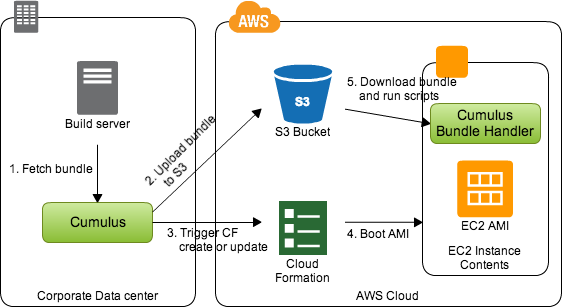

Cumulus Deployment Suite
========================

Cumulus is a deployment suite used to deploy and manage environments built
with AWS CloudFormation. Cumulus will help you bundle your code and
configuration and unpack the bundle to new instances on CloudFormation.

The target for the Cumulus project is to make cloud deployments scriptable,
reliable and repeatable. It is of great importance for productivity and
product stability that you are able to release often and with as few manual
steps as possible.

Cumulus consists of two parts, ``cumulus`` which is used to manage the software
bundling and deployment and the ``cumulus-bundle-handler`` which handles
the software installation on the target servers.

Table of contents
-----------------
.. toctree::
    :maxdepth: 3

    overview
    installation
    cumulus
    cumulus_bundle_handler
    cf_examples
    cumulus_release_notes
    bug_reporting
    license
